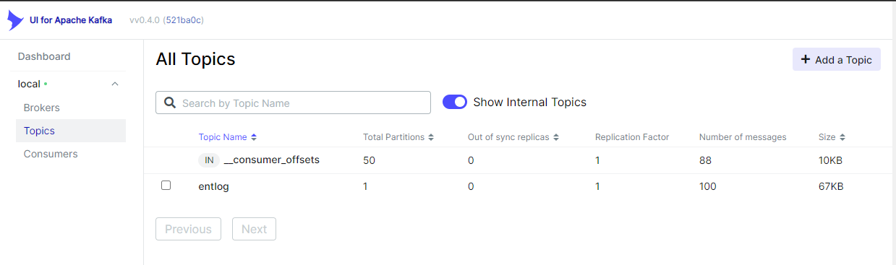
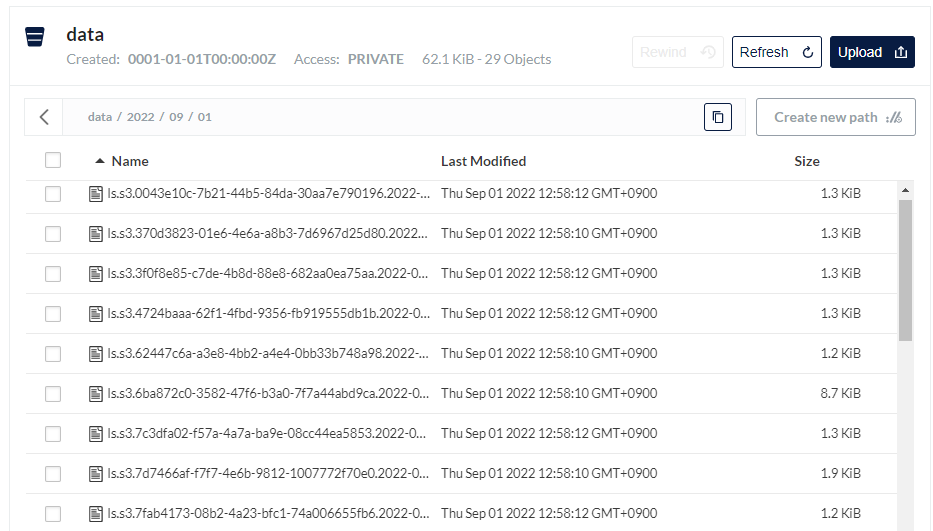

## Log stream pipeline
- docker-compose 환경의 로그 스트림 테스트 환경 구성 
- ( filebeat | http ) → Logstash → Kafka → Logstash → MinIO (S3)

### docker-comose up  

```sh
$ docker-compose up -d
Creating network "logstash_default" with the default driver
Creating logstash-1 ... done
Creating minio      ... done
Creating kafka      ... done
Creating logstash-2 ... done
Creating zookeeper  ... done
Creating kafka-ui   ... done

$ docker-compose ps
   Name                 Command               State                                              Ports
--------------------------------------------------------------------------------------------------------------------------------------------------
kafka        start-kafka.sh                   Up      0.0.0.0:9092->9092/tcp,:::9092->9092/tcp
kafka-ui     /bin/sh -c java $JAVA_OPTS ...   Up      0.0.0.0:8082->8080/tcp,:::8082->8080/tcp
logstash-1   /usr/local/bin/docker-entr ...   Up      0.0.0.0:5044->5044/tcp,:::5044->5044/tcp, 0.0.0.0:8044->8044/tcp,:::8044->8044/tcp, 9600/tcp
logstash-2   /usr/local/bin/docker-entr ...   Up      0.0.0.0:5045->5044/tcp,:::5045->5044/tcp, 0.0.0.0:8045->8044/tcp,:::8045->8044/tcp, 9600/tcp
minio        /usr/bin/docker-entrypoint ...   Up      0.0.0.0:9000->9000/tcp,:::9000->9000/tcp, 0.0.0.0:9001->9001/tcp,:::9001->9001/tcp
zookeeper    /bin/sh -c /usr/sbin/sshd  ...   Up      0.0.0.0:2181->2181/tcp,:::2181->2181/tcp, 22/tcp, 2888/tcp, 3888/tcp
```

### MinIO Bucket initialize 

```sh
$ rclone --config local.conf mkdir local:data

```

### Log 생성 (http)

```sh
$ cat payload.json | wc -l
100

$ cat payload.json | head -n2
{"_id": "00005fd72a6e000000000006af19", "loadavg": 0.019999999552965164, "processor": 0, "timestamp": "2021-05-02T03:40:47.000Z", "activesession": 2}
{"_id": "00005fd72a6e000000000006af1a", "loadavg": 1.809999942779541, "processor": 4.599999904632568, "timestamp": "2021-06-22T05:25:24.000Z", "activesession": 3}

$ cat payload.json | xargs -i curl http://localhost:8044/entlog -d '{}'
```

```sh
$ rclone --config local.conf ls local:data
     1305 2022/09/01/ls.s3.0043e10c-7b21-44b5-84da-30aa7e790196.2022-09-01T03.58.part25.txt
     1310 2022/09/01/ls.s3.370d3823-01e6-4e6a-a8b3-7d6967d25d80.2022-09-01T03.58.part8.txt
     1280 2022/09/01/ls.s3.3f0f8e85-c7de-4b8d-88e8-682aa0ea75aa.2022-09-01T03.58.part16.txt
     1308 2022/09/01/ls.s3.4724baaa-62f1-4fbd-9356-fb919555db1b.2022-09-01T03.58.part26.txt
     1273 2022/09/01/ls.s3.62447c6a-a3e8-4bb2-a4e4-0bb33b748a98.2022-09-01T03.58.part7.txt
     8924 2022/09/01/ls.s3.6ba872c0-3582-47f6-b3a0-7f7a44abd9ca.2022-09-01T03.58.part6.txt
     1312 2022/09/01/ls.s3.7c3dfa02-f57a-4a7a-ba9e-08cc44ea5853.2022-09-01T03.58.part21.txt
     1932 2022/09/01/ls.s3.7d7466af-f7f7-4e6b-9812-1007772f70e0.2022-09-01T03.58.part0.txt
     1240 2022/09/01/ls.s3.7fab4173-08b2-4a23-bfc1-74a006655fb6.2022-09-01T03.58.part27.txt
     1313 2022/09/01/ls.s3.830b446b-75ab-4c41-92cb-8d55b5df89ac.2022-09-01T03.58.part17.txt
     1932 2022/09/01/ls.s3.8525aac1-ef13-4109-9a96-3595de385717.2022-09-01T03.58.part9.txt
     1274 2022/09/01/ls.s3.862c014d-105e-4101-827a-6e031bcf6c4f.2022-09-01T03.58.part1.txt
     1966 2022/09/01/ls.s3.8f7bb6d1-cf1a-4955-b272-7a57a477ff69.2022-09-01T03.58.part10.txt
     1308 2022/09/01/ls.s3.9427d131-3b9c-49c1-bd28-69a19f8a00bc.2022-09-01T03.58.part18.txt
     4584 2022/09/01/ls.s3.a04c493d-79f3-4e0e-9e16-fa6ab1542b83.2022-09-01T03.58.part4.txt
     1310 2022/09/01/ls.s3.a1c24516-911a-4a9c-8358-21517c93a093.2022-09-01T03.58.part23.txt
     4516 2022/09/01/ls.s3.aeaf552d-f897-4a5e-9c20-a203641fb817.2022-09-01T03.58.part3.txt
     1311 2022/09/01/ls.s3.bf992052-bf59-42d0-91de-79b4efe78889.2022-09-01T03.58.part20.txt
     3834 2022/09/01/ls.s3.c806149a-07d8-4a55-a9a3-d7b32ab1e0b4.2022-09-01T03.58.part5.txt
     1312 2022/09/01/ls.s3.c85d2b19-dbd5-434e-87ee-a3a004bb2db1.2022-09-01T03.58.part15.txt
     5698 2022/09/01/ls.s3.cda6c464-f074-410e-b71f-2fc5f41d1657.2022-09-01T03.58.part2.txt
     1963 2022/09/01/ls.s3.d81a7d1c-da51-4780-9b1d-7ae708cdaa27.2022-09-01T03.58.part19.txt
     1282 2022/09/01/ls.s3.d9037b8d-52b9-4a0f-bd7c-241831735bad.2022-09-01T03.58.part22.txt
     1242 2022/09/01/ls.s3.dce38e9d-f048-4067-b6e5-ace645ce8e07.2022-09-01T03.58.part28.txt
     1207 2022/09/01/ls.s3.de5479c3-5e8c-477f-aec3-b7e0a7587343.2022-09-01T03.58.part12.txt
     1312 2022/09/01/ls.s3.e6c6e4f4-d325-45ba-b00d-a4b0136ec2c5.2022-09-01T03.58.part11.txt
     1244 2022/09/01/ls.s3.ec9da562-dac4-4e49-a36e-692233cd7828.2022-09-01T03.58.part13.txt
     1962 2022/09/01/ls.s3.f130c5fb-abc0-4e10-b92d-0b8f67795813.2022-09-01T03.58.part24.txt
     3182 2022/09/01/ls.s3.fb743132-97da-4869-ad9f-22fdc9709091.2022-09-01T03.58.part14.txt
```

---

### Kafka UI



### MinIO UI

